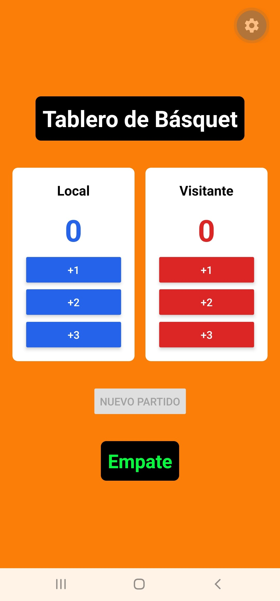
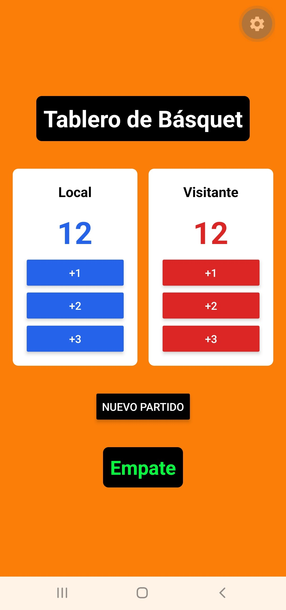
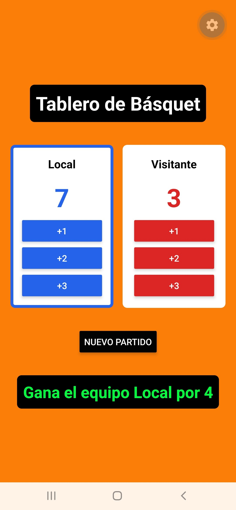
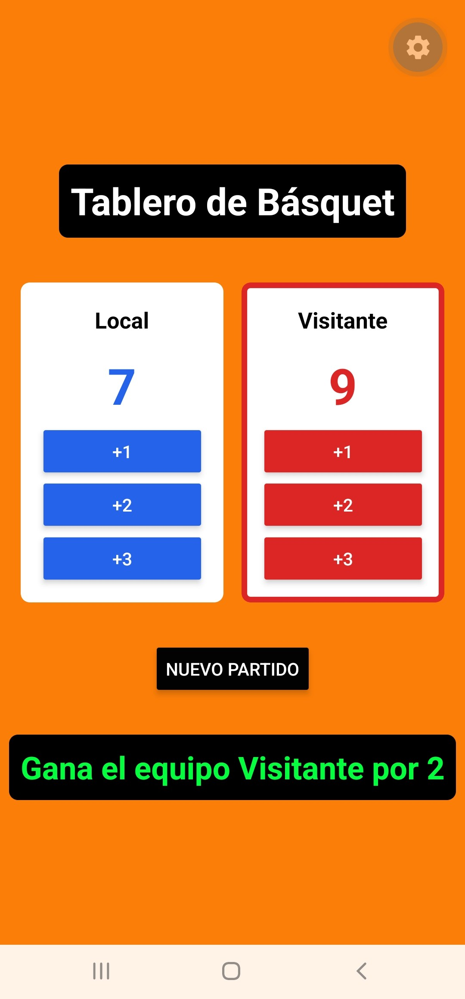

# Aplicación Marcador de Básquet (Clase Asincrónica 01/10)

>En este repositorio se encuentra el código de la aplicación solicitada **Marcador de Básquet**. Esta aplicación cumple con los tres ejercicios planteados, desarrollados uno por cada commit (ej. "Ejercicio 1"). 

# Capturas de pantalla de la aplicacion en funcionamiento: #

<table>
  <tr>
    <th>Pantalla de Inicio</th>
    <th>Empate</th>
    <th>Victoria Azul</th>
    <th>Victoria Roja</th>
  </tr>
  <tr>
    <td></td>
    <td></td>
    <td></td>
    <td></td>
  </tr>
</table>

# En la clase, el ejercicio de tres contadores tenía el useState adentro de 'Contador'. Acá te pedimos lo contrario. ¿Por qué acá el estado tiene que vivir en el padre? (Pista: pensá en el Ejercicio 3.)

>Respuesta Ejercicio 2
>1) El estado debe vivir en el padre, porque si cada './PanelEquipo' guardara su propio estado en un useState local, el componente padre no podria comparar ambos puntajes para calcular quien va ganando (consigna del Ejercicio 3), mostrar la leyenda de diferencia ni deshabilitar el boton de "Nuevo partido". Al tener el estado en el padre, la pantalla principal centraliza los datos y puede pasárselos a los hijos. 
